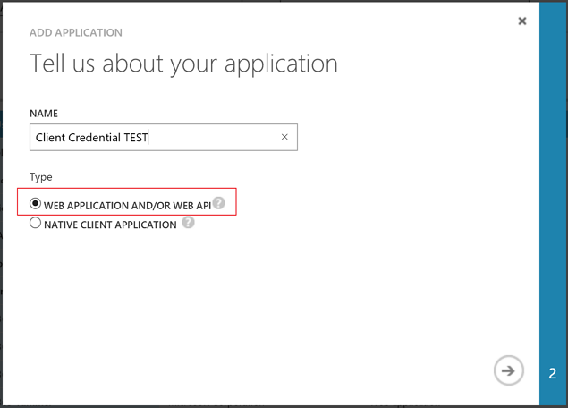
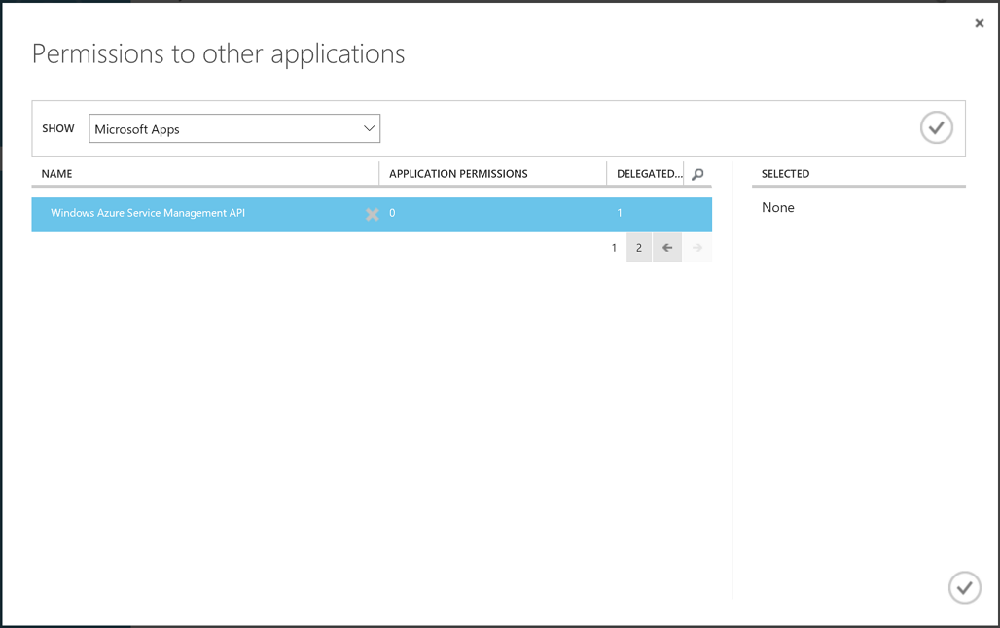
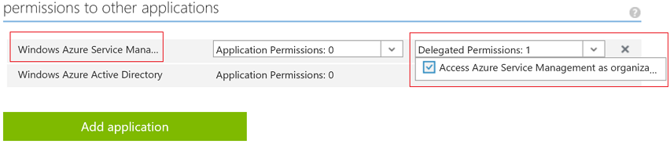
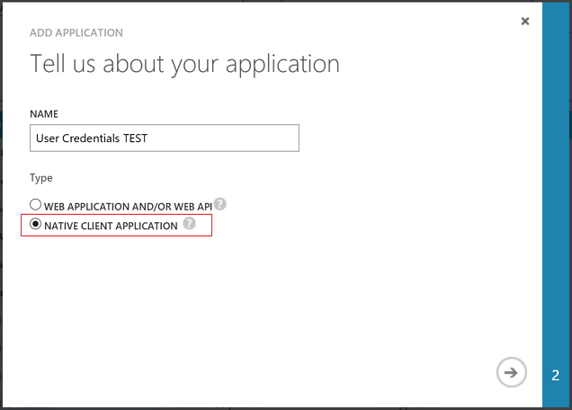
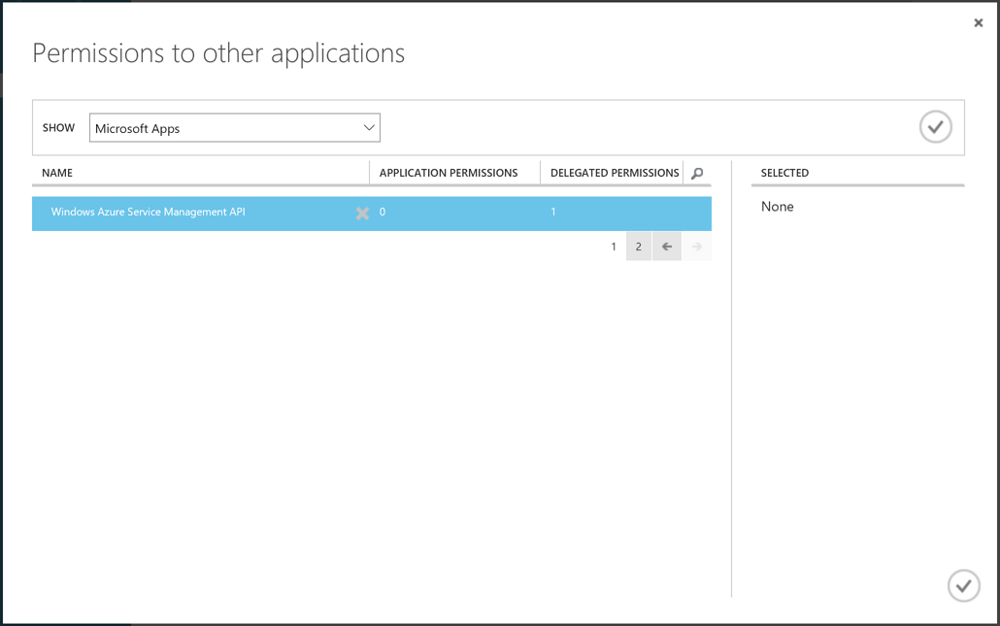
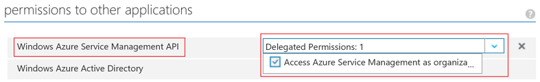

# Application Insights WebTests SDK #

[](https://ci.appveyor.com/project/justinyoo/application-insights-webtests-sdk/branch/dev) | [](https://www.nuget.org/packages/Aliencube.Azure.Insights.WebTests.SDK)

This provides an extended SDK for WebTests of Application Insights which is not supported by [Azure SDK for .NET](https://github.com/Azure/azure-sdk-for-net).


## Getting Started ##

### Configuring `App.config` or `Web.config` ###

This SDK uses custom config sections.

```xml
<configuration>
  <configSections>
    <section name="webTestSettings"
             type="Aliencube.Azure.Insights.WebTests.Services.Settings.WebTestSettingsElement, Aliencube.Azure.Insights.WebTests.Services" />
  </configSections>

  ...

  <webTestSettings>
    <authentication clientId="[CLIENT_ID]"
                    clientSecret="[CLIENT_SECRET]"
                    useServicePrinciple="false"
                    username="[USERNAME]"
                    password="[PASSWORD]"
                    tenantName="[TENANT_NAME]"
                    aadInstance="https://login.microsoftonline.com/"
                    managementInstance="https://management.core.windows.net/" />

    <applicationInsights name="[APPLICATION_INSIGHTS_NAME]"
                         resourceGroup="[RESOURCE_GROUP_NAME]"
                         subscriptionId="[SUBSCRIPTION_ID]" />

    <webTests>
      <webTest testType="UrlPingTest" status="enabled"
               parseDependentRequests="true" retriesForWebTestFailure="enable" frequency="5"
               testLocations="AuSydney|UsCaSanJose">
        <successCriteria timeout="120" requireHttpResponse="true" statusCodeMustEqual="200" requireContentMatch="false" />
        <alerts status="enabled" alertLocationThreshold="1" alertFailureTimeWindow="5" sendAlertToAdmin="true"
                recipients="[COMMA_DELIMITED_EMAILS]" />
      </webTest>

      <webTest testType="MultiStepTest" status="enabled"
               parseDependentRequests="true" retriesForWebTestFailure="enable" frequency="5"
               testLocations="AuSydney|UsCaSanJose">
        <successCriteria timeout="120" requireHttpResponse="true" statusCodeMustEqual="200" requireContentMatch="false" />
        <alerts status="enabled" alertLocationThreshold="1" alertFailureTimeWindow="5" sendAlertToAdmin="true"
                recipients="[COMMA_DELIMITED_EMAILS]" />
      </webTest>
    </webTests>
  </webTestSettings>

  ...
</configuration>
```


### Using `ClientCredential` ###

Using `ClientCredential` requires `ClientId` and `ClientSecret`. Therefore, when we register an application to AAD, we should choose the `WEB APPLICATION AND/OR WEB API` option.
 


Then, add an application to the `Permissions to other applications` section like:





By doing so, we can access to Azure resoures using ADAL without providing username and password like:

```csharp
var clientId = "CLIENT_ID";
var clientSecret = "CLIENT_SECRET";
var aad = "https://login.microsoftonline.com/[TENANT_NAME].onmicrosoft.com";
var url = "https://management.core.windows.net/";
var subscriptionId = "SUBSCRIPTION_ID";

var context = new AuthenticationContext(aad, false);

var cc = new ClientCredential(clientId, clientSecret);
var result = await context.AcquireTokenAsync(url, cc).ConfigureAwait(false);

var credential = new TokenCloudCredentials(subscriptionId, result.AccessToken);
var client = new ResourceManagementClient(credential);
```


### Using `UserCredential` ###

Using `UserCredential` only requires `ClientId` and it's not compatible with the `ClientId` value from `ClientCredential`. Hence, when we register an application to AAD, we should use the `NATIVE CLIENT APPLICATION` option.



Then, add an application to the `Permissions to other applications` section like:





By doing so, we can access to Azure resoures using ADAL with username and password like:

```csharp
var clientId = "CLIENT_ID";
var username = "user.name@email.com";
var password = "PASSWORD";
var aad = "https://login.microsoftonline.com/[TENANT_NAME].onmicrosoft.com";
var url = "https://management.core.windows.net/";
var subscriptionId = "SUBSCRIPTION_ID";

var context = new AuthenticationContext(aad, false);

var uc = new UserPasswordCredential(username, password);
var result = await context.AcquireTokenAsync(url, clientId, uc).ConfigureAwait(false);

var credential = new TokenCloudCredentials(subscriptionId, result.AccessToken);
var client = new ResourceManagementClient(credential);
```


### Importing `WebTestService` ###

```csharp
var name = "WebTestSample";
var url = "http://localhost";

using (var settings = WebTestSettingsElement.CreateInstance())
using (var context = new AuthenticationContextWrapper($"{settings.Authentication.AadInstanceUrl.TrimEnd('/')}/{settings.Authentication.TenantName}.onmicrosoft.com", false))
using (var service = new WebTestService(settings, context))
{
  var processed = await service.ProcessAsync(name, url).ConfigureAwait(false);
}
```


## Contribution ##

Your contributions are always welcome! All your work should be done in your forked repository. Once you finish your work with corresponding tests, please send us a pull request onto our `dev` branch for review.


## License ##

**Application Insights WebTests SDK** is released under [MIT License](http://opensource.org/licenses/MIT)

> The MIT License (MIT)
>
> Copyright (c) 2016 [aliencube.org](http://aliencube.org)
> 
> Permission is hereby granted, free of charge, to any person obtaining a copy of this software and associated documentation files (the "Software"), to deal in the Software without restriction, including without limitation the rights to use, copy, modify, merge, publish, distribute, sublicense, and/or sell copies of the Software, and to permit persons to whom the Software is furnished to do so, subject to the following conditions:
> 
> The above copyright notice and this permission notice shall be included in all copies or substantial portions of the Software.
> 
> THE SOFTWARE IS PROVIDED "AS IS", WITHOUT WARRANTY OF ANY KIND, EXPRESS OR IMPLIED, INCLUDING BUT NOT LIMITED TO THE WARRANTIES OF MERCHANTABILITY, FITNESS FOR A PARTICULAR PURPOSE AND NONINFRINGEMENT. IN NO EVENT SHALL THE AUTHORS OR COPYRIGHT HOLDERS BE LIABLE FOR ANY CLAIM, DAMAGES OR OTHER LIABILITY, WHETHER IN AN ACTION OF CONTRACT, TORT OR OTHERWISE, ARISING FROM, OUT OF OR IN CONNECTION WITH THE SOFTWARE OR THE USE OR OTHER DEALINGS IN THE SOFTWARE.
